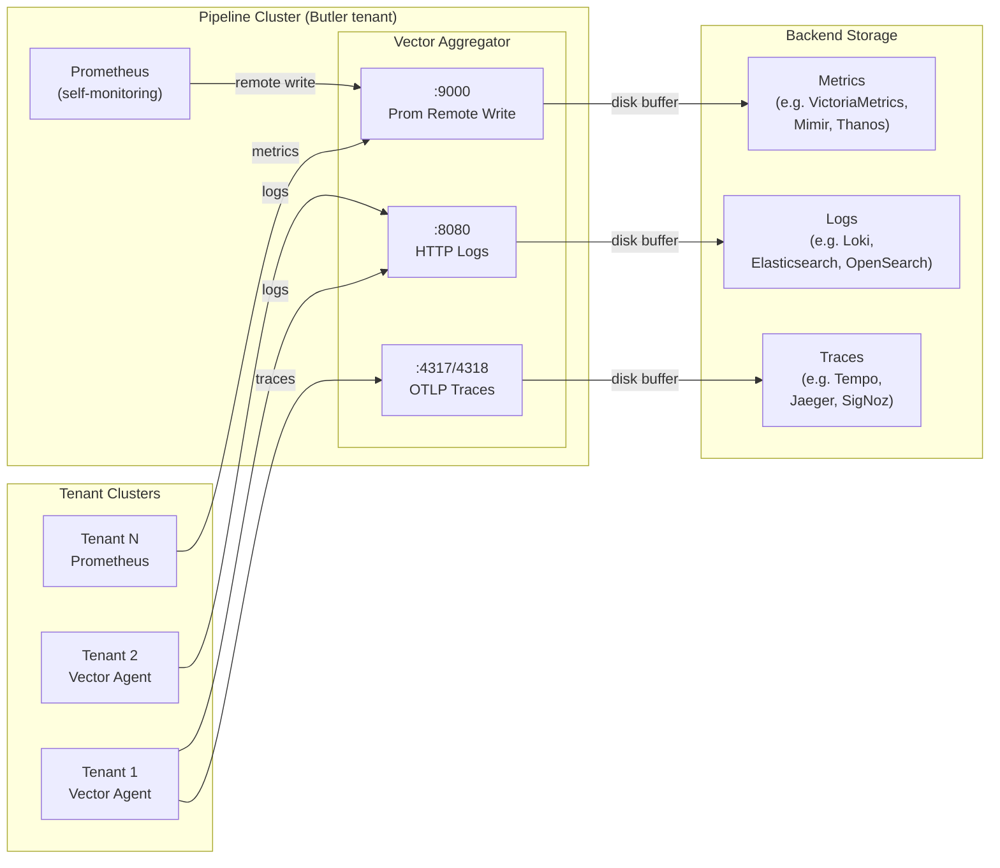
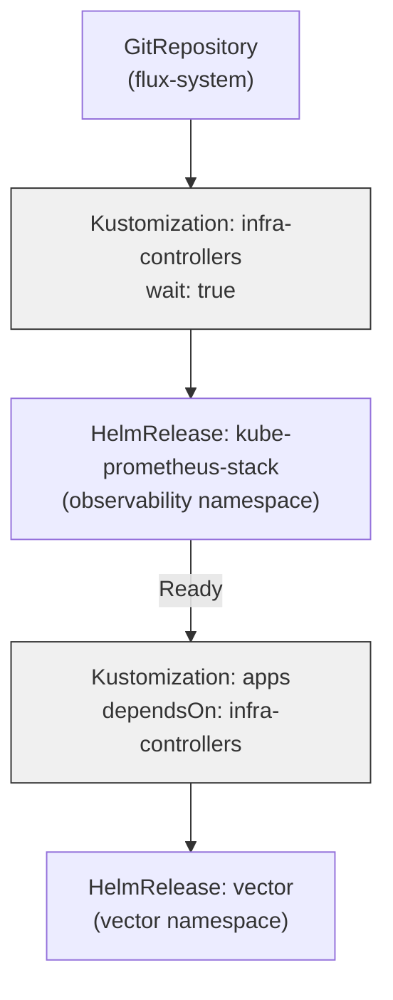

# Butler Observability Pipeline Reference

Production-proven Vector aggregator pattern packaged as a fork-and-deploy GitOps reference. Used for high-volume telemetry transformation and routing in production environments across multiple companies. Parameterized for any Butler installation. Deploys a Vector aggregator (receives metrics, logs, and traces from tenant agents) and a kube-prometheus-stack instance (monitors the aggregator's own health). Both components are managed by Flux on a designated pipeline cluster.

## Architecture

The pipeline cluster is itself a Butler-managed tenant cluster, designated for running the observability aggregator. It follows the same lifecycle as any other tenant — provisioned through Butler, managed via GitOps — but its workload is the pipeline infrastructure rather than application services.



## What This Isn't

- **Not Butler-managed at runtime.** Butler's auto-enroll system deploys agents to tenant clusters. The aggregator deploys once per pipeline cluster and is owned by the customer via GitOps. Butler has no runtime control over this deployment.
- **No secret management.** The reference assumes plain HTTP to internal network endpoints. If your backends require authentication, you provision and manage credentials yourself (SealedSecrets, external-secrets-operator, or manual kubectl). See [CUSTOMIZATION.md](docs/CUSTOMIZATION.md) for auth patterns.
- **No backend storage.** This reference deploys the pipeline, not the backends it sends to. You need existing backend instances before deploying this. The default sinks target VictoriaMetrics (metrics), Loki (logs), and Tempo (traces), but Vector supports a wide range of sink types — any Prometheus remote-write-compatible metrics store, any Loki-compatible log aggregator, and any OTLP-compatible trace backend will work. Swap the sink type and endpoint to match your stack.
- **No console integration.** The Butler console doesn't manage the aggregator. Pipeline registration in ButlerConfig points tenant agents at this aggregator's LoadBalancer IP, but the aggregator itself is GitOps-managed.

## Quick Start

1. Fork this repository
2. Replace the 5 `REQUIRED_` placeholders in `apps/dev/vector-values.yaml` and `apps/prd/vector-values.yaml`
3. Rename `clusters/pipeline-dev` and `clusters/pipeline-prd` to match your cluster names
4. Bootstrap Flux on each pipeline cluster pointing at your fork
5. Verify pods are Ready and data is flowing

See [DEPLOYMENT.md](docs/DEPLOYMENT.md) for the full step-by-step walkthrough.

## Repository Layout

```
apps/
  base/vector/         Shared resources: Namespace, HelmRepository, HelmRelease (version: "*", no values)
  dev/                 Dev overlay: chart version pin + full Vector config + dev-sized resources
  prd/                 Prd overlay: chart version pin + full Vector config + prd-sized resources
infrastructure/
  controllers/         kube-prometheus-stack for pipeline self-monitoring (common values baked in)
  configs/             Standalone CRs depending on controller CRDs (currently empty)
clusters/
  pipeline-dev/        Flux wiring for dev: flux-system, infrastructure.yaml (env patches), apps.yaml
  pipeline-prd/        Flux wiring for prd: same structure, prd-specific patches
docs/
  DEPLOYMENT.md        Fork-to-running deployment guide
  CUSTOMIZATION.md     Override patterns for scaling, auth, optional sources
CONTRIBUTING.md        How to contribute to this reference
LICENSE                Apache 2.0
```

This follows the [flux2-kustomize-helm-example](https://github.com/fluxcd/flux2-kustomize-helm-example) reference structure. Infrastructure controllers are flat multi-document YAML with environment-specific overrides applied as inline patches on the Flux Kustomization CR. App workloads use Kustomize base/overlay with strategic merge patches. Tier ordering ensures CRD-providing controllers reconcile before app workloads.

## What Gets Deployed

This reference deploys two components per pipeline cluster:

- **Vector aggregator**: the observability pipeline that receives data from tenant agents and forwards to backend storage. Sources: HTTP (logs from Vector agents on port 8080), Prometheus remote write (metrics on port 9000), OTLP (traces on ports 4317/4318), plus self-monitoring metrics and logs. Default sinks target VictoriaMetrics, Loki, and Tempo, but any compatible backend works — Vector supports [dozens of sink types](https://vector.dev/docs/reference/configuration/sinks/). All critical sinks use disk buffers with backpressure (no silent data loss).

- **kube-prometheus-stack**: monitors the aggregator's own health, resource usage, and pipeline throughput. Without this, pipeline degradation is invisible until it surfaces downstream. Grafana and Alertmanager are disabled — Prometheus scrapes locally and remote-writes to the Vector aggregator, which forwards to VictoriaMetrics alongside tenant metrics. Includes Flux CRD state metrics for monitoring GitOps reconciliation health.

Both are required for an operationally complete pipeline cluster. Customers who already have a monitoring stack on their pipeline cluster can disable the included kube-prometheus-stack via Flux Kustomization patch (remove or empty the infrastructure.yaml patches block).

### Flux Reconciliation Order



Infrastructure controllers reconcile first and must report Ready before app workloads begin. This ensures CRD-providing controllers (Prometheus Operator CRDs) are available before workloads that depend on them.

## Versioning

| Component | Version | Source |
|-----------|---------|--------|
| Vector Helm chart | ~0.52.0 | Production pin |
| Vector image | timberio/vector:0.55.0-alpine | Production pin |
| kube-prometheus-stack | ~67.0.0 | Production pin |

These versions match what runs in production pipeline clusters as of the audit date. Customers can bump versions deliberately — see the upgrade procedure in [CUSTOMIZATION.md](docs/CUSTOMIZATION.md).

## Origin

Extracted from a production observability pipeline processing metrics, logs, syslog, SNMP traps, and OTLP traces from 15+ tenant clusters across two structurally identical environments (dev + prd) on Butler-managed infrastructure. The reference extracts the generalizable pattern, parameterizes deployment-specific endpoints, and gates environment-specific sources (SNMP, syslog) as opt-in.

## Further Reading

- [DEPLOYMENT.md](docs/DEPLOYMENT.md) — prerequisites, pre-deployment checklist, step-by-step deployment, validation, troubleshooting
- [CUSTOMIZATION.md](docs/CUSTOMIZATION.md) — scaling, authentication, optional sources, custom sinks, naming conventions
