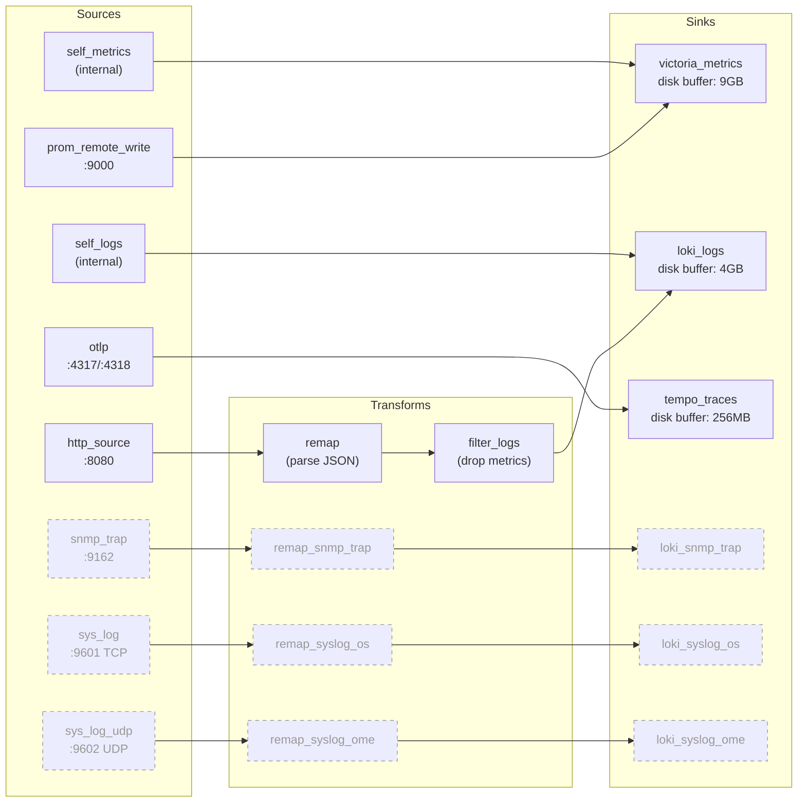
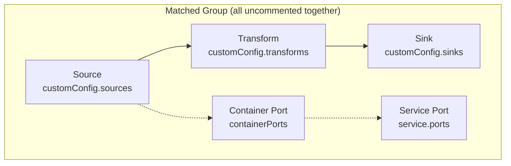
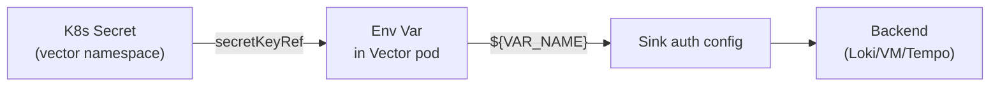
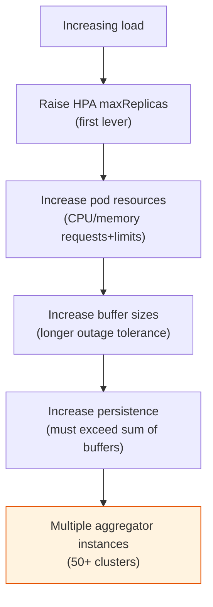

# Customization Guide

Override patterns for extending the reference beyond its production-proven defaults.

## Vector Pipeline Topology

The Vector aggregator processes three signal types through a source-transform-sink pipeline. Core sources are always enabled; optional sources (dashed) are commented out and enabled per environment.



## When to Override Which Values

The dev and prd overlays ship with sizing presets proven in production. Override when your workload characteristics differ.

**Resources** — override when Vector pods are consistently above 70% CPU or memory utilization, or when HPA is scaling to maxReplicas regularly. The prd preset (2000m/4Gi request, 4000m/8Gi limit) handles ~15 tenant clusters. Scale linearly with cluster count and ingest volume.

**HPA bounds** — the prd preset (3-20 replicas) handles bursty ingest patterns. Raise `maxReplicas` if HPA consistently hits the ceiling. Lower `minReplicas` only if you accept slower ramp-up on traffic spikes.

**Persistence** — the prd preset (20Gi) provides disk buffer space for all sinks. If you increase buffer sizes (longer outage tolerance), increase persistence proportionally. Each Vector pod gets its own PVC.

**Buffer sizes** — disk buffers absorb backend outages. The prd preset tolerates:
- Metrics sink: ~9GB buffer ≈ several hours of metrics at moderate ingest
- Logs sink: ~4GB buffer ≈ several hours of logs at moderate ingest
- Traces sink: ~256MB buffer ≈ minutes of traces

Increase buffer sizes if your backends have longer maintenance windows or if you need to survive longer outages without dropping data. Buffer size is bounded by persistence volume size.

## Enabling Optional Sources

Optional sources are commented out in matched groups: source, transform(s), sink(s), containerPort, and service port. All pieces in a group must be uncommented together for the source to work.



### SNMP Trap (port 9162)

Receives SNMP trap data forwarded as JSON over HTTP. Uncomment all of the following in `apps/<env>/vector-values.yaml`:

1. **Source**: `snmp_trap` under `customConfig.sources`
2. **Transform**: `remap_snmp_trap` under `customConfig.transforms`
3. **Sink**: `loki_snmp_trap` under `customConfig.sinks`
4. **Container port**: the `snmp` entry under `containerPorts`
5. **Service port**: the `snmp` entry under `service.ports`

Fill in the `REQUIRED_` placeholders in the sink (endpoint, tenant_id, pipeline name) to match your Loki configuration.

### Syslog (TCP 9601, UDP 9602)

Receives syslog messages. TCP (port 9601) and UDP (port 9602) are separate sources with separate transforms and sinks, allowing different label sets for different syslog sources (e.g., OS syslog vs hardware management syslog). Uncomment all of the following:

1. **Sources**: `sys_log` and `sys_log_udp` under `customConfig.sources`
2. **Transforms**: `remap_syslog_os` and `remap_syslog_ome` under `customConfig.transforms`
3. **Sinks**: `loki_syslog_os` and `loki_syslog_ome` under `customConfig.sinks`
4. **Container ports**: `syslog` and `syslog-udp` under `containerPorts`
5. **Service ports**: `syslog` and `syslog-udp` under `service.ports`

### Adding a New Source

Follow the matched-group pattern:

1. Add the source under `customConfig.sources` with a unique name and port
2. Add any transforms needed to parse or enrich the data
3. Add a sink targeting the appropriate backend
4. Add the container port under `containerPorts`
5. Add the service port under `service.ports`
6. Test the full path: send data to the source port, confirm it arrives at the backend

## Backend Authentication

Authentication is disabled by default. The reference assumes plain HTTP to internal network endpoints — the security boundary is the network itself. This is the production-proven pattern when backends are colocated on the same internal network.

For backends requiring authentication, each sink type has a different auth mechanism. The general pattern:



1. Provision a Secret in the `vector` namespace containing the credentials
2. Mount the Secret's keys as environment variables via the `env` block in the overlay values
3. Reference the environment variables in the sink's auth configuration using `${VAR_NAME}` syntax

### Loki (basic auth)

In the overlay values, uncomment and configure:

```yaml
env:
  - name: LOKI_USERNAME
    valueFrom:
      secretKeyRef:
        name: backend-credentials
        key: loki-username
  - name: LOKI_PASSWORD
    valueFrom:
      secretKeyRef:
        name: backend-credentials
        key: loki-password
```

In each Loki sink (`loki_logs` and any optional sinks), add the auth block:

```yaml
sinks:
  loki_logs:
    type: loki
    auth:
      strategy: basic
      user: "${LOKI_USERNAME}"
      password: "${LOKI_PASSWORD}"
    # ... rest of sink config
```

### VictoriaMetrics (bearer token)

```yaml
env:
  - name: VM_BEARER_TOKEN
    valueFrom:
      secretKeyRef:
        name: backend-credentials
        key: vm-token
```

```yaml
sinks:
  victoria_metrics:
    type: prometheus_remote_write
    auth:
      strategy: bearer
      token: "${VM_BEARER_TOKEN}"
    # ... rest of sink config
```

### Tempo (header-based auth)

The opentelemetry sink type uses HTTP headers for auth:

```yaml
env:
  - name: TEMPO_TOKEN
    valueFrom:
      secretKeyRef:
        name: backend-credentials
        key: tempo-token
```

```yaml
sinks:
  tempo_traces:
    type: opentelemetry
    protocol:
      type: http
      headers:
        Authorization: "Bearer ${TEMPO_TOKEN}"
    # ... rest of sink config
```

### Secret provisioning

The reference does not ship a secret management pattern. The customer provisions the Secret using whichever approach they prefer:

- **SealedSecrets**: seal the Secret with kubeseal, commit the SealedSecret manifest to the repository. The sealed-secrets controller decrypts it on the cluster.
- **external-secrets-operator**: create an ExternalSecret CR referencing a secret store (AWS Secrets Manager, HashiCorp Vault, etc.). The operator syncs the Secret to the cluster.
- **Manual**: `kubectl create secret generic backend-credentials --from-literal=loki-username=... -n vector`. Not GitOps-managed, but works for getting started.

The credential Secret must exist in the `vector` namespace before the Vector HelmRelease reconciles. If the Secret is missing, Vector pods will fail to start (env var references are required, not optional, once uncommented).

## Adding Custom Sinks

The reference ships three sinks targeting VictoriaMetrics, Loki, and Tempo as representative backends. These are not requirements — Vector supports a wide range of sink types. You can replace any default sink with one targeting your preferred backend (e.g., Mimir or Thanos instead of VictoriaMetrics, Elasticsearch instead of Loki, Jaeger instead of Tempo) by changing the sink `type` and `endpoint` in the overlay values.

To add additional sinks beyond the defaults:

1. Define the sink under `customConfig.sinks` with a unique name
2. Set `inputs` to reference the appropriate sources or transforms
3. Configure the sink type, endpoint, encoding, and auth per Vector's documentation
4. Add a disk buffer if the sink targets a backend that may be temporarily unavailable

Example — adding a second Loki sink for a different tenant:

```yaml
sinks:
  loki_team_b:
    type: loki
    inputs: ["filter_logs"]
    endpoint: "http://loki-team-b:3100"
    tenant_id: "team-b"
    encoding:
      codec: json
    out_of_order_action: "accept"
    labels:
      pipeline: "obs-pipeline"
      service_name: "vector"
      env: "prd"
      team: "team-b"
    buffer:
      type: disk
      max_size: 2147483648
      when_full: block
```

When this is appropriate: dual-writing to a backup Loki instance, splitting logs by team or tenant, forwarding to an external analytics service.

## Scaling Beyond the Prd Preset

The prd preset handles a production load of ~15 tenant clusters. For larger deployments:



### HPA ceiling

Raise `autoscaling.maxReplicas` beyond 20. Vector's aggregator role is stateless for processing — each replica handles an independent share of incoming connections. The bottleneck shifts to sink throughput (backend write capacity) before Vector's horizontal scaling limit.

### Resource increases

Scale resources proportionally. If doubling tenant count, start with doubling requests and limits. Monitor actual usage after the change and tune.

### Buffer sizing

Larger buffers tolerate longer backend outages at the cost of disk space. The formula: `buffer_bytes = ingest_rate_bytes_per_second * max_outage_seconds`. The prd preset's 9GB metrics buffer holds several hours of metrics at moderate ingest. Increase if your backends have longer maintenance windows.

### Persistence sizing

Persistence must be at least as large as the sum of all buffer max_size values configured for that pod. If you increase buffers, increase persistence proportionally.

### Multiple aggregator instances

For very large deployments (50+ tenant clusters or very high ingest volume), consider running multiple aggregator instances behind a load balancer rather than scaling a single HPA-managed deployment indefinitely. This provides failure isolation — a backend outage filling one aggregator's buffers doesn't affect the others.

This requires splitting tenant traffic across aggregator instances at the network level (DNS, L4 load balancer, or per-tenant Butler pipeline configuration).

## Naming Conventions

The reference uses generic names that describe what the resources do, rather than historical names inherited from the source deployment:

- **loki_logs** instead of `loki_grafana_cloud` — the sink sends to Loki, not necessarily Grafana Cloud. The original name reflected a Grafana Cloud-hosted Loki instance; the reference targets self-hosted or any Loki-compatible endpoint.

- **vector_pipeline_self_metrics** instead of `vector_obsrvpipe_self_metrics` — generic pipeline identifier rather than a deployment-specific abbreviation. This is the metrics namespace prefix for Vector's internal_metrics source.

To rename: search-and-replace in the overlay values. Sink names and the metrics namespace are configuration values, not referenced by external systems (except Loki label queries and PromQL queries that use the namespace prefix). Update any dashboards or alerts that reference the old names.

## Upgrading Vector

1. Update the chart version in `apps/dev/vector-values.yaml` (the `spec.chart.spec.version` field)
2. Update the image tag in the same file (the `image.tag` field)
3. Commit and push. Flux reconciles on the dev pipeline cluster.
4. Validate: pods healthy, metrics flowing, logs flowing, traces flowing. Monitor for 24-48h.
5. Copy the version updates to `apps/prd/vector-values.yaml`.
6. Commit and push. Monitor the prd pipeline cluster.

The chart version and image tag are independent — the chart bundles a default image tag, but the overlay explicitly pins the image tag. When upgrading, check the chart release notes for the expected image version.

## Disabling kube-prometheus-stack

If your pipeline cluster already has a monitoring stack:

1. Remove or empty the `patches:` block in `clusters/<name>/infrastructure.yaml`
2. Optionally remove `infrastructure/controllers/prometheus-operator.yaml` from the repository entirely

If you remove kube-prometheus-stack but want Vector's self-metrics to still flow to VictoriaMetrics, ensure the `self_metrics` source and `victoria_metrics` sink remain in the Vector config. The kube-prometheus-stack installation is for scraping the pipeline cluster's own workloads and Flux state, not for Vector's self-metrics pipeline (which is internal to Vector).
